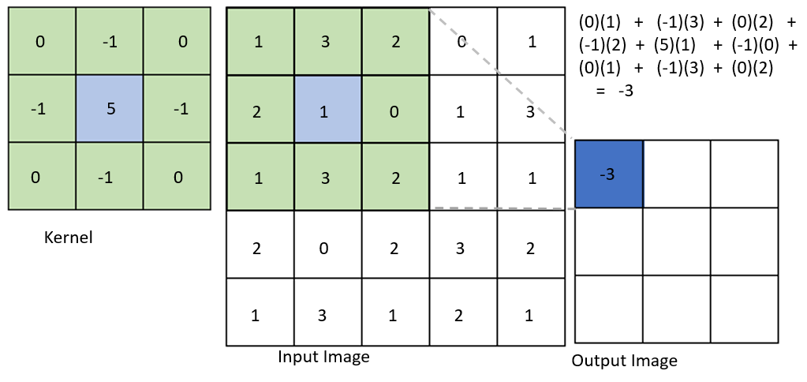
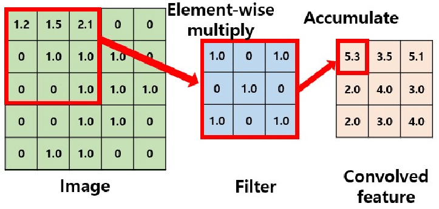

# Atividade OpenACC - Reimplementação

Nesta atividade você deverá reimplementar parte da atividade **Atividade - Lab 04 - Programação OpenMP** utilizando agora  **OpenACC**. As partes que deverão ser reimplementadas estão abaixo.

No arquivo `openacc_files.zip` tem exemplos de como usar o OpenACC de modo eficiente, lidando com movimentação de dados entre a placa e a memória principal; você deve estudar e rodar cada um para entender como funciona.

O notebook COMPPAR_OpenACC.ipynb mostra como rodar códigos com OpenACC no Google Colab.

Você deverá entregar os códigos (notebooks) com as implementações em OpenACC, a saída da execução com o _profiler_ e prints da tela mostrando a execução.

O relatório deverá ser feito totalmente no notebook; nas primeiras células do notebook, coloque os resultados da execução dos seguintes comandos: `nvidia-smi` e `nvaccelinfo`.

Adicione uma descrição do que cada componente da dupla realizou na atividade.

Esta atividade poderá ser realizada em **dupla**; a entrega será toda aqui pelo GitHub.

## Labs a serem reimplementados em OpenACC

### Lab 1 - Programação - Integral Regra do Trapézio (em aula)

Faça o código da integral pela regra do trapézio; pode utilizar a explicação mostrada nos slides de Introdução ao OpenMP (

04 - Programacao de Memoria Compartilhada com OpenMP - ch5), na página 24.

### Lab 3 -  - Nova multiplicação de matrizes

Faça um programa de multiplicação de matrizes. Fique atento a um bom uso de cache (L1/L2)

Você deve gerar ou buscar algumas imagens sintéticas de tamanho 1048x1048, 4096x4096; pelo menos 3 imagens de cada tamanho. As imagens devem ser em nível de cinza (pode pegar uma colorida e transformar para nível de cinza); você também pode gerar matrizes com números aleatórios entre 0 e 255 e preencher essas 6 matrizes.

Depois você vai utilizar os seguintes kernels para fazer a aplicação nessas matrizes: 5x5, 11x11 e 33x33.

Esses kernels são aplicados em todos os elementos das matrizes, criando uma **nova** matriz resultado. Essa matriz resultado, para essa nossa atividade, terá um tamanho menor do que a original. Esse processo é conhecido como *convolução* é amplamente utilizado em redes neurais convolucionais.

Essa figura ilustra esse processo

Assim como essa aqui.

